# LuxNode: Distributed ESP32 Smart Lighting System

# LuxNode Legacy Hardware: ESP32 Distributed Ecosystem

Ten folder zawiera dokumentację techniczną modułów PCB zaprojektowanych dla systemu **LuxNode**. Jest to autorski ekosystem rozproszonej automatyki, oparty na mikrokontrolerach ESP32, wykorzystujący magistralę CAN oraz łączność radiową nRF24L01+.

Caly projekt PCB jest dostepny pod adresami: [oshwlab.com](https://oshwlab.com/JLUK/esp32_can_nrf_copy) | [easyeda.com](https://easyeda.com/editor#project_id=7421841e90244079ad9d0232d063693e) 

> [!IMPORTANT]
> **Status Projektu: Legacy / Archiwalny.** > Warstwa programowa nie jest już rozwijana. Rozwiązania sprzętowe zawarte w tym repozytorium służą jako baza dla nowej generacji systemu dostępnej pod adresami:  
> [ot_app](https://github.com/HareoPL/ot_app) | [ot_app_stm](https://github.com/HareoPL/ot_app_stm) | [ot_app_esp](https://github.com/HareoPL/ot_app_esp)

## 🏗 Przegląd Modułów Systemowych

System został zaprojektowany w architekturze modularnej, dzieląc zadania na jednostki sterujące (interfejs użytkownika) oraz wykonawcze.

### 1. Control Device (Button Unit)
Kompaktowy moduł sterujący zaprojektowany do montażu w standardowej puszce podtynkowej. Stanowi główne ogniwo interakcji użytkownika z systemem.

* **Interfejs:** Wyświetlacz OLED informujący o statusie (PWM, temperatura, CAN/nRF ID, status WiFi, przekaźnik).
* **Komunikacja:** Dual-path (CAN-BUS + nRF24L01+).
* **Sensoryka:** Obsługa czujników temperatury (One-Wire) oraz fizycznych przycisków sterujących.
* **Wyjście:** Zintegrowany przekaźnik do bezpośredniego sterowania obwodem oświetleniowym.

  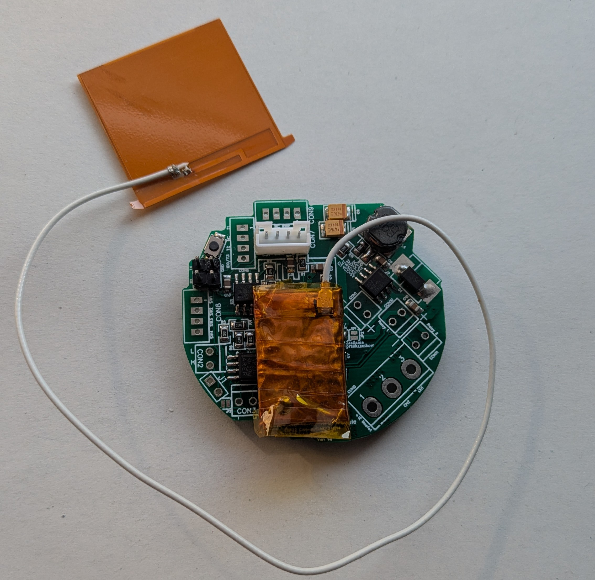
  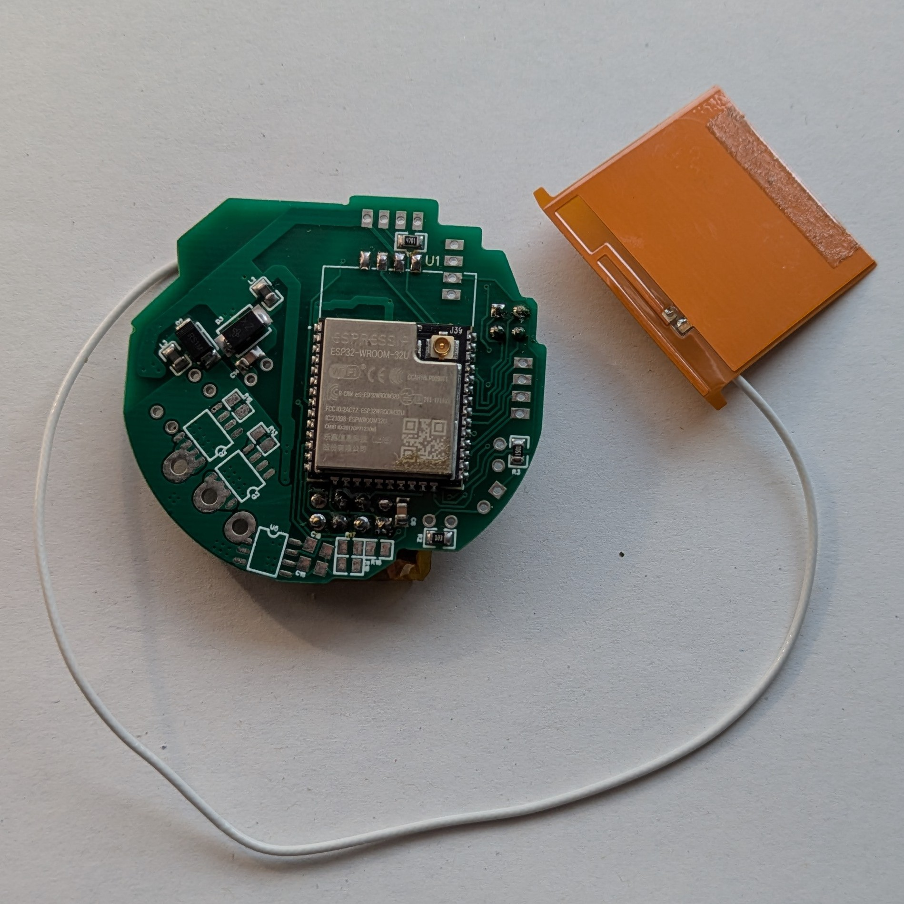
  
<em>Fotografia zmontowanego urządzenia: widok frontu oraz tyłu płytki.</em>

### 2. Light Device (Feature Controller)
Zaawansowana płyta główna integrująca wiele standardów sterowania w jednym module. Zaprojektowana jako uniwersalny "hub" wykonawczy.

* **Napędy:** Możliwość sterowania dwoma silnikami krokowymi (sloty na sterowniki **DRV8825**).
* **Sekcja LED RGB:** 3 wysokoprądowe kanały MOSFET z pełną izolacją galwaniczną za pomocą układów **TLP250**.
* **Pomiar Mocy:** Zintegrowany czujnik **ACS712** do monitorowania prądu obciążenia na kanałach MOSFET.
* **Zasilanie i Izolacja:**
    * Możliwość wspólnego zasilania z linii LED/Silników.
    * System zworek na PCB pozwalający na całkowitą separację napięć logiki od sekcji mocy.
* **Dodatki:** Wyjście przekaźnikowe, obsługa wyświetlacza, magistrala One-Wire.

  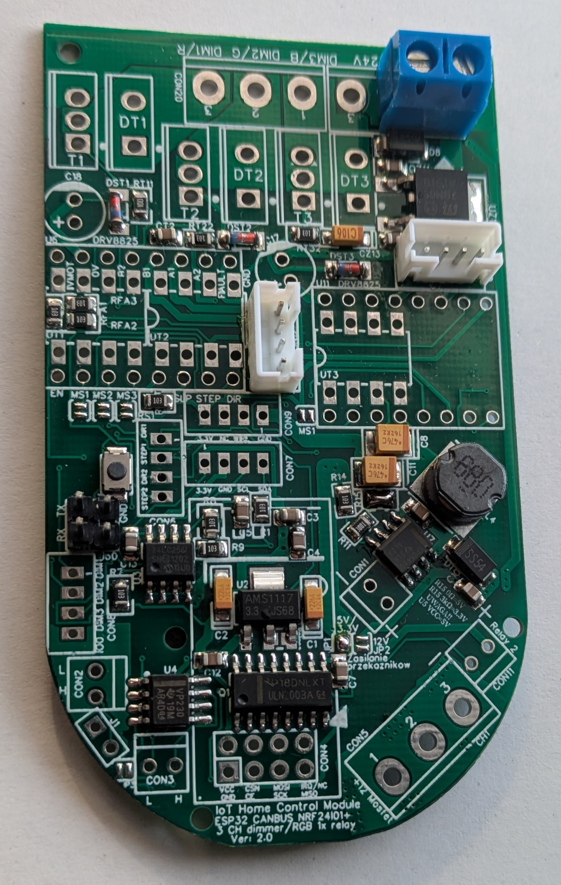
  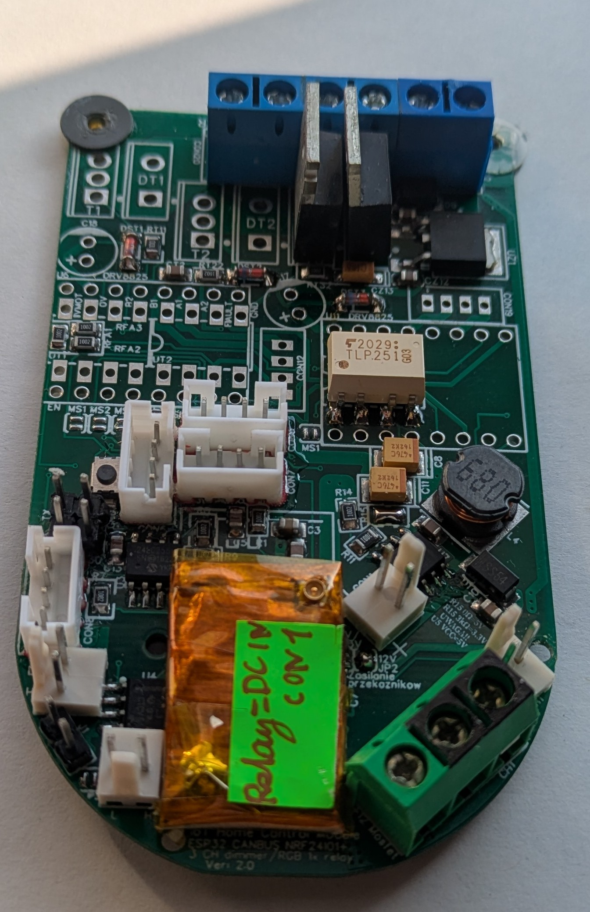
  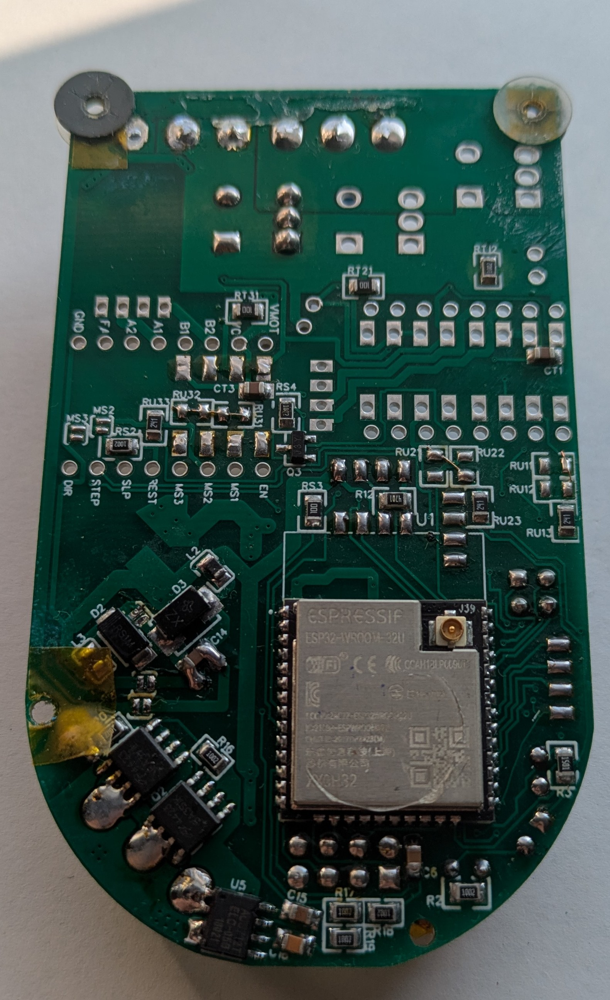
  
<em>Zmontowana płyta jako moduł oświetlenia</em>

  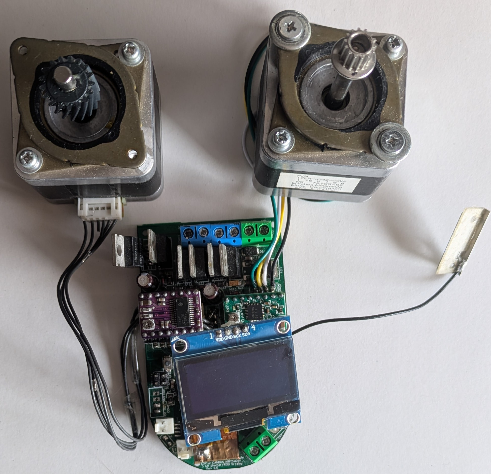
  
  
<em>Zmontowana płyta jako moduł sterowania silnikami krokowymi.</em>

  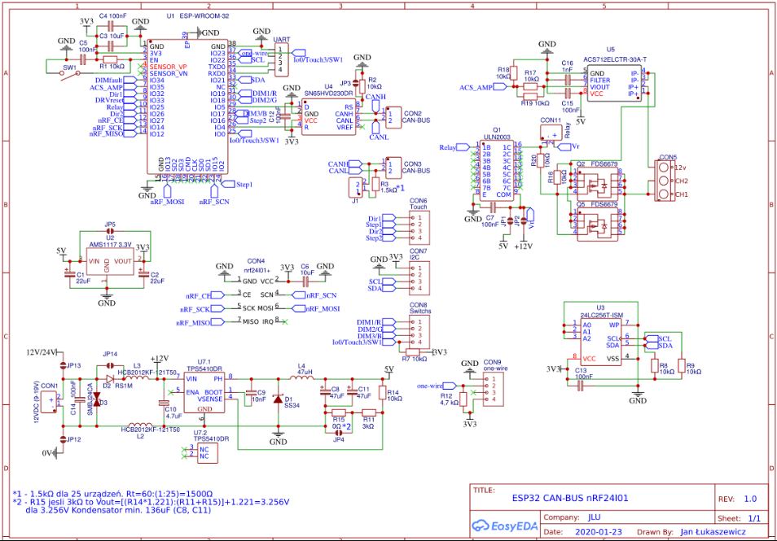
  
<em>Fotografia schematu.</em>

## 🔌 Moduły Pomocnicze i Rozszerzenia

W ramach projektu powstał szereg wyspecjalizowanych modułów rozszerzających możliwości jednostek głównych.

### ⚡ Mini Moduł Przekaźnika Wysokonapięciowego
Bezpieczny moduł przełączający dla dużych obciążeń AC/DC.
* **Kluczowanie:** Dwa MOSFETy mocy **IPZ60R040C7** ($600V$, $50A$, $R_{DS(on)} = 40m\Omega$).
* **Izolacja:** Photovoltaic MOSFET Driver **VOM1271T** zapewniający barierę izolacyjną między MCU a wysokim napięciem.
* **Bezpieczeństwo:** Zintegrowany bezpiecznik termiczny.

  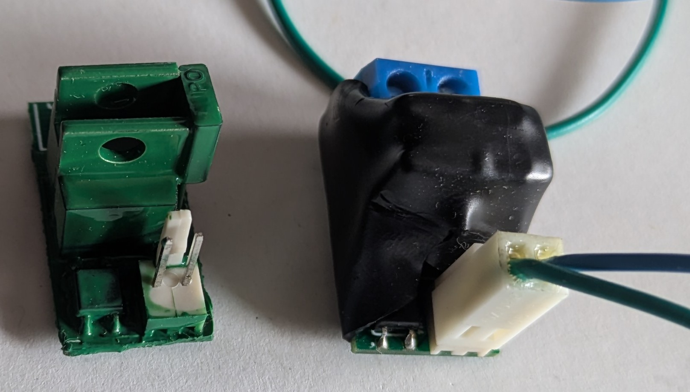
  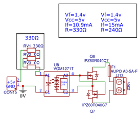

### 📡 Moduł Zasilania i Komunikacji GSM (SIM800L)
Dedykowany moduł zapewniający stabilne warunki pracy dla układu SIM800L.
* **Zasilanie:** Precyzyjna sekcja buck ustawiona na $4.128V$ (wymagane dla stabilnej pracy SIM800L przy skokach poboru prądu w trakcie logowania do sieci).
* **Komunikacja:** Interfejs UART (komendy AT).

  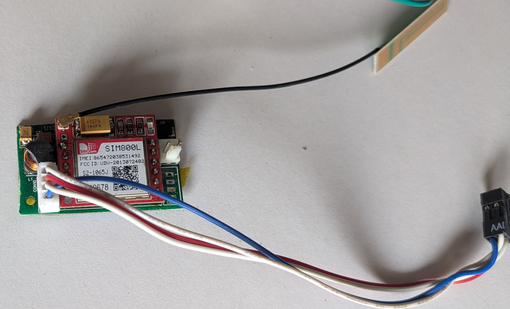
  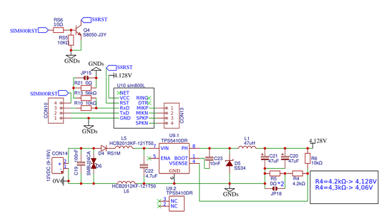

### 🔅 Zewnętrzny Kanał PWM z Izolacją
Jednokanałowy moduł rozszerzający dla sterowania jasnością LED lub prędkością silników DC.
* **Driver:** Układ **TLP250** zapewniający szybkie przełączanie i ochronę mikrokontrolera przed zakłóceniami z sekcji mocy.

  
  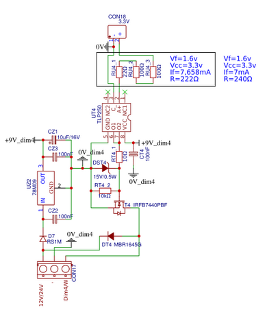
  
<em>External PWM module.Fotografia schematu. </em>

#### 🧪 Testy i Walidacja (Bench Testing)
Moduł PWM został poddany testom oscyloskopowym w celu weryfikacji poprawności kluczowania przy wysokich częstotliwościach ($25\text{ kHz}$).

  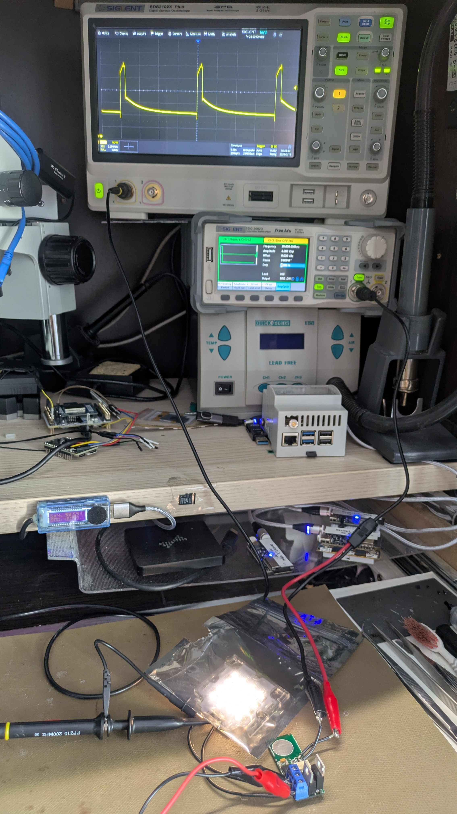
  
  
<em>Badanie czasu narastania oraz opadania zboczy przy czestotliwosci 25kHz .</em>

Testy potwierdziły wysoką stabilność drivera TLP250 oraz czyste zbocza sygnału sterującego obciążeniem LED.

## 🎬 Demo i Prezentacja Systemu

Poniżej przedstawiono finalną formę modułu sterującego (Control Device) po montażu w obudowie oraz materiał wideo prezentujący działanie ekosystemu.

### Control Device w obudowie
Moduł został zaprojektowany z myślą o estetycznym montażu podtynkowym, zapewniając łatwy dostęp do przycisków i czytelność parametrów na wyświetlaczu OLED.

  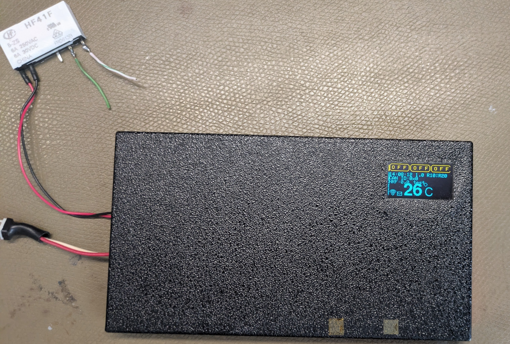
  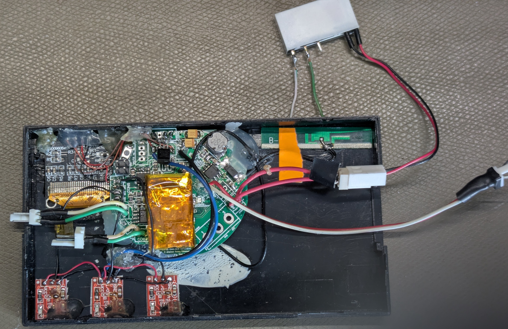
  
<em>Finalna wersja modułu sterującego w obudowie.</em>

### Prezentacja Wideo
Kliknij w poniższy obrazek, aby przejść do prezentacji wideo na platformie YouTube:

## 📦 Kompletna Rodzina Modułów LuxNode

Projekt obejmuje pełen zestaw wyspecjalizowanych jednostek, które wspólnie tworzą elastyczny system sterowania oświetleniem i automatyką.

  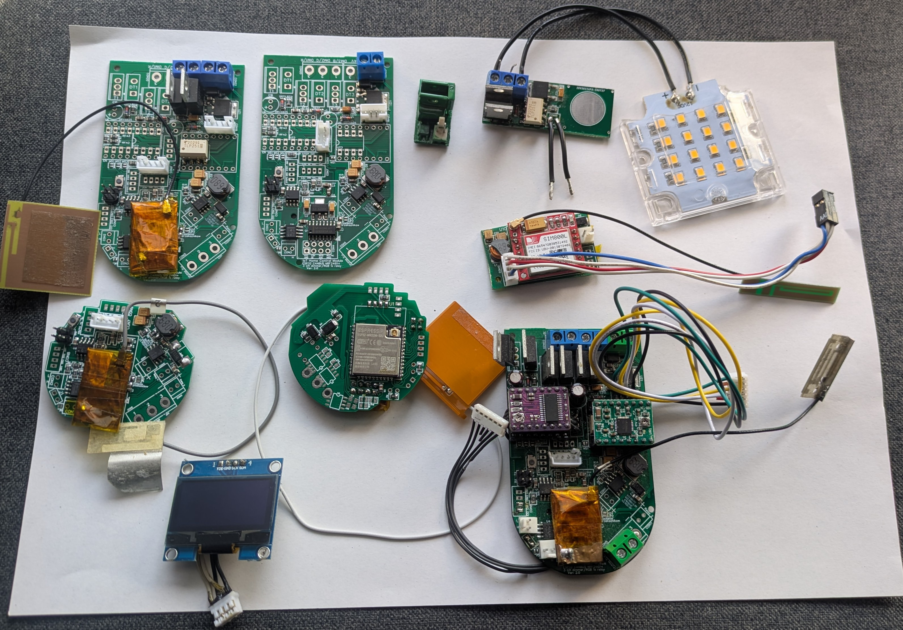
  
<em>Zestawienie wszystkich modułów zaprojektowanych w ramach projektu.</em>

**Podsumowanie Projektu:** Choć warstwa software'owa (v1.0) nie jest już rozwijana, powyższy hardware stanowi solidną bazę do dalszych eksperymentów z protokołami CAN i nRF24. Wiedza zdobyta przy projektowaniu tych modułów (szczególnie w zakresie izolacji galwanicznej mocy i stabilizacji zasilania GSM) jest obecnie implementowana w nowej generacji ekosystemu [ot_app](https://github.com/HareoPL/ot_app).

## 🌐 Interfejs Web i Konfiguracja Zdalna

Każdy moduł oparty na układzie **ESP32** posiada zintegrowany serwer WWW, który umożliwia pełną personalizację urządzenia z poziomu przeglądarki, bez konieczności używania zewnętrznych programatorów.

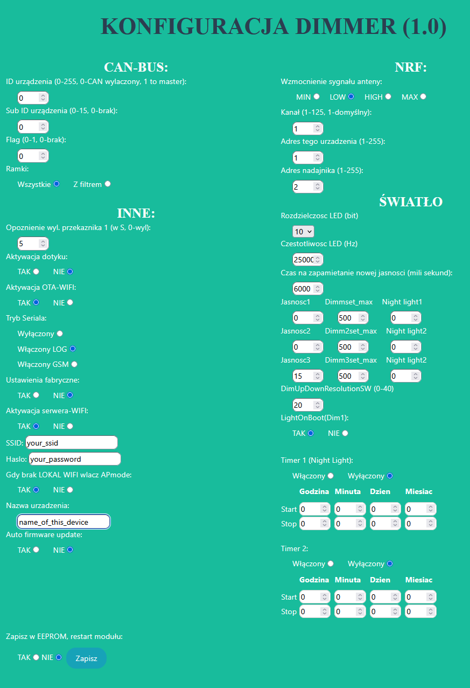

<em>Panel konfiguracyjny LuxNode Dimmer (v1.0).</em>

### Kluczowe możliwości panelu:

  * **Zarządzanie Magistralami:** Ustawianie ID urządzenia dla CAN-BUS oraz parametrów nRF (kanał, adresy, wzmocnienie anteny).
  * **Zaawansowane Parametry Światła:** Precyzyjna kontrola częstotliwości PWM (np. 25 kHz dla eliminacji migotania) oraz ustawianie czasu płynnego przejścia jasności.
  * **Harmonogramy (Timers):** Konfiguracja dwóch niezależnych timerów dla funkcji *Night Light* z precyzją co do minuty i dnia miesiąca.
  * **Utrzymanie i Sieć:** Obsługa aktualizacji firmware przez WiFi (OTA), konfiguracja trybu AP (Access Point) w przypadku braku lokalnej sieci oraz zapis wszystkich parametrów w pamięci nieulotnej EEPROM.

## 🛠 Specyfikacja Techniczna PCB

* **Oprogramowanie EDA:** EasyEDA.
* **Standardy Komunikacji:**
    * **CAN-BUS:** 500kbps.
    * **nRF24L01+:** 2.4GHz.
    * **UART:** Komendy AT (GSM).
* **Zabezpieczenia:** Izolacja galwaniczna (optoizolatory, drivery bramkowe), zabezpieczenia termiczne, monitorowanie prądu.

## 🚀 Przyszłość Projektu
Hardware LuxNode został sprawdzony w boju i posłużył jako fundament pod nową architekturę **ot_app**. Nowe wersje płytek będą skupiać się na:
1. Przejściu na mikrokontrolery STM32 w sekcjach wykonawczych.
2. Zastosowaniu nowocześniejszych układów komunikacyjnych.
3. Pełnej integracji z nowym interfejsem Dashboardu.

**Projektant:** Jan Łukaszewicz 
